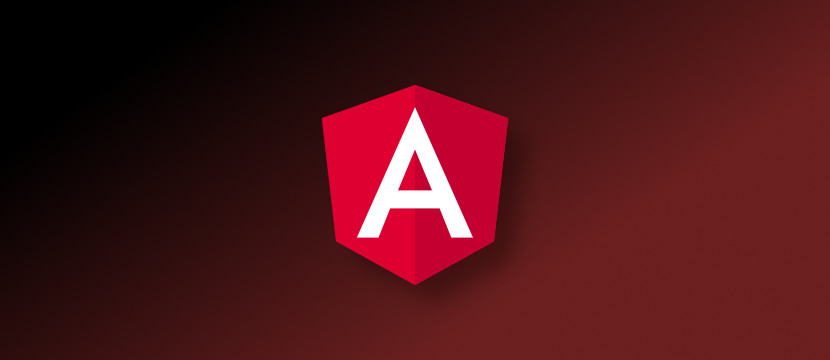
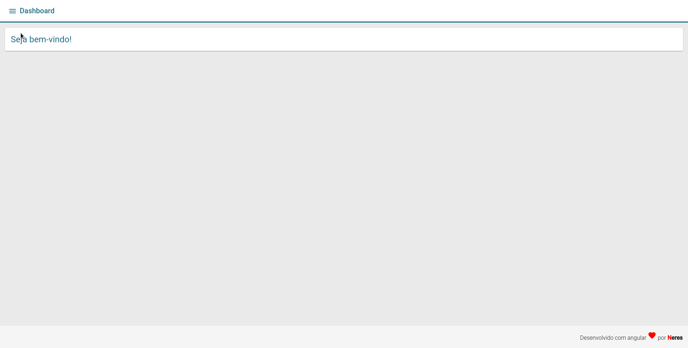

  

<h1 align="center">Angular Crud</h1> 

•<a href="#-sobre-o-projeto">Sobre</a> •
 <a href="#-ferramentas">Ferramentas</a> •
 <a href="#-como-executar-o-projeto">Como executar</a> • 
 <a href="#-visualização">Como executar</a> • 

---

## 💻 Sobre o projeto
Um CRUD simples para testar os meus conhecimentos dentro do framework 

---

## 🛠 Ferramentas
As seguintes ferramentas foram usadas na construção do projeto:
- Angular
- Typescript
- Material Design
- Javascript
- Json-Server
- Scss

---

## 🚀 Como executar o projeto
**Basta fazer os seguintes passos...**

- Basta instalar as dependências na pasta `backend` e na pasta `frontend` projeto usando:
> `yarn install `

- E para rodar o projeto:
> `yarn start`

---

## 👀 Visualização

**
Projeto em execução.
**

---

## 📝 Licença

Este projeto esta sobe a licença [MIT](./LICENSE).

Feito com ❤️ por Alan Neres 👋🏽 [Entre em contato!](https://www.linkedin.com/in/alan-neres/)

---

## 👨‍💻 Ainda em desenvolvimento (TODO)

- [ ] Criar nível de acesso.
- [ ] Adicionar tela de login
- [ ] Adicionar Guard para as rotas
- [ ] Criar um Interceptor para enviar token nas requisições
- [ ] Adicionar um novo crud de categorias que se relaciona com produtos
- [ ] Criar um novo módulo de clientes
  - [ ] Tela de exibição dos produtos.